---
## Front matter
title: "Отчёт по лабораторной работе №1"
subtitle: "Простые модели компьютерной сети"
author: "Гэинэ Андрей НФИбд-02-22"

## Generic otions
lang: ru-RU
toc-title: "Содержание"

## Bibliography
bibliography: bib/cite.bib
csl: pandoc/csl/gost-r-7-0-5-2008-numeric.csl

## Pdf output format
toc: true # Table of contents
toc-depth: 2
lof: true # List of figures
lot: true # List of tables
fontsize: 12pt
linestretch: 1.5
papersize: a4
documentclass: scrreprt
## I18n polyglossia
polyglossia-lang:
  name: russian
polyglossia-otherlangs:
  name: english
## I18n babel
babel-lang: russian
babel-otherlangs: english
## Fonts
mainfont: Arial
romanfont: Arial
sansfont: Arial
monofont: Arial
mainfontoptions: Ligatures=TeX
romanfontoptions: Ligatures=TeX
sansfontoptions: Ligatures=TeX,Scale=MatchLowercase
monofontoptions: Scale=MatchLowercase,Scale=0.9
## Biblatex
biblatex: true
biblio-style: "gost-numeric"
biblatexoptions:
  - parentracker=true
  - backend=biber
  - hyperref=auto
  - language=auto
  - autolang=other*
  - citestyle=gost-numeric
## Pandoc-crossref LaTeX customization
figureTitle: "Рис."
tableTitle: "Таблица"
listingTitle: "Листинг"
lofTitle: "Список иллюстраций"
lotTitle: "Список таблиц"
lolTitle: "Листинги"
## Misc options
indent: true
header-includes:
  - \usepackage{indentfirst}
  - \usepackage{float} # keep figures where there are in the text
  - \floatplacement{figure}{H} # keep figures where there are in the text
---

# Цель работы

Приобретение навыков моделирования сетей передачи данных с помощью средства имитационного моделирования NS-2, а также анализ полученных результатов
моделирования.

# Задание

1. Реализовать топологию сети, состоящую из двух узлов и одного соединения в NS-2.
2. Реализовать кольцевую топологию сети в NS-2.
3. Реализовать видоизмененную кольцевую топологию сети в NS-2.

# Выполнение лабораторной работы

Создал директорию и файл шаблона (рис. [-@fig:001])

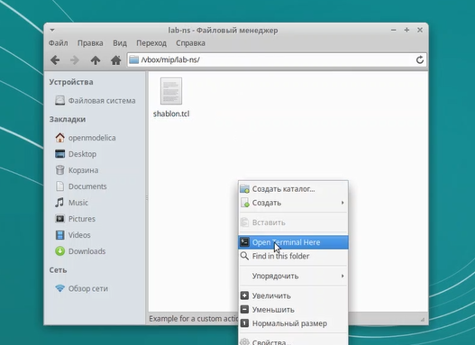{ #fig:001 width=70% }

Создал переменную nf и указал, что требуется открыть на запись nam-файл для регистрации выходных результатов моделирования (рис. [-@fig:002])

{ #fig:002 width=70% }

Создал переменную f и открыл на запись файл трассировки для регистрации всех событий модели. Написал процедуру finish (рис. [-@fig:003])

{ #fig:003 width=70% }

С помощью команды at указал планировщику событий, что процедуру finish следует запустить через 5 с после начала моделирования, после чего запустить симулятор ns (рис. [-@fig:004])

{ #fig:004 width=70% }

Сохранил изменения и запустил программу (рис. [-@fig:005])

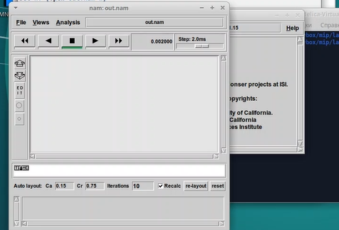{ #fig:005 width=70% }

Создал example1.tcl. Написал программу (часть 1) (рис. [-@fig:006])

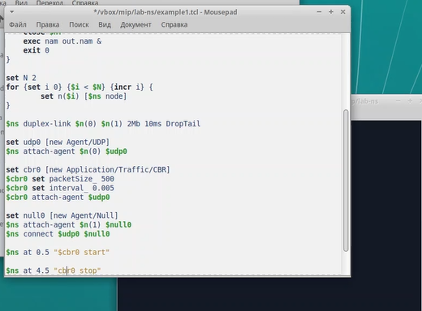{ #fig:006 width=70% }

Запустил код программы example1.tcl. Просмотрел движение пакетов данных (рис. [-@fig:008])

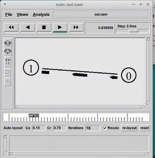{ #fig:008 width=70% }

Создал новый файл example2.tcl. В нем создал 4 узла и 3 дуплексных соединения с указанием направления. (рис. [-@fig:009])

{ #fig:009 width=70% }

Запустил код программы example2.tcl. Просмотрел движение пакетов данных (рис. [-@fig:011])

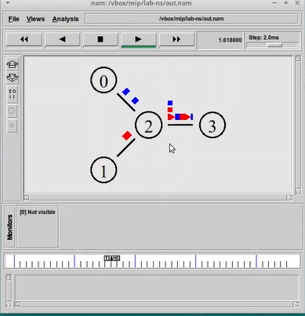{ #fig:011 width=70% }

Создал новый файл example3.tcl. Написал первую чать программы (рис. [-@fig:012])

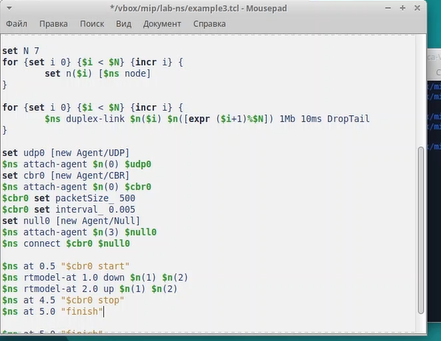{ #fig:012 width=70% }

Запустил код программы example3.tcl. Просмотрел движение пакетов данных в случае разрыва соединения (рис. [-@fig:013])

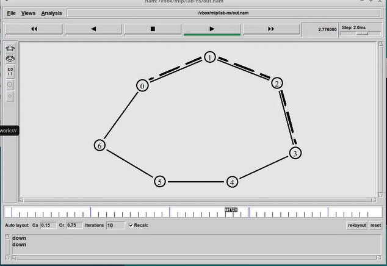{ #fig:013 width=70% }

Написал код для программы из Упражнения (рис. [-@fig:015])

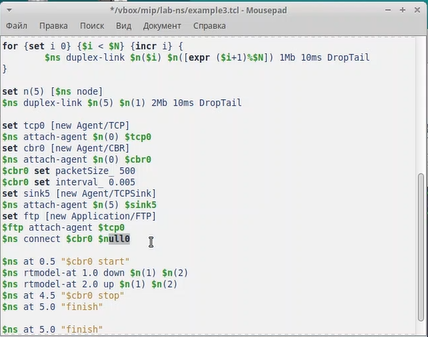{ #fig:015 width=70% }

Запустил программу. Вначале пакеты идут по кратчайшему пути. (рис. [-@fig:016])

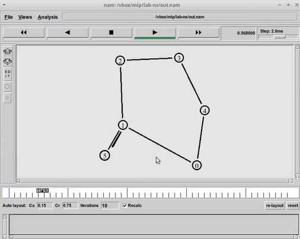{ #fig:016 width=70% }

Движение пакетов в случае разрыва соединения. (рис. [-@fig:017])

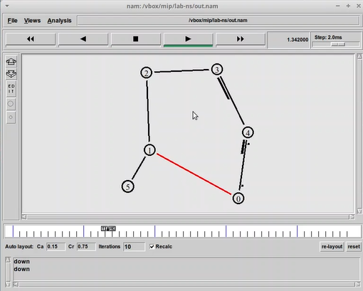{ #fig:017 width=70% }

Пакеты снова идут по кратчайшему пути (рис. [-@fig:018])

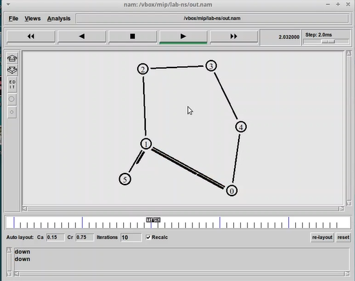{ #fig:018 width=70% }

# Выводы

Приобрел навыки моделирования сетей передачи данных с помощью средств имитационного моделирования NS-2, а также анализа полученных результатов моделирования.