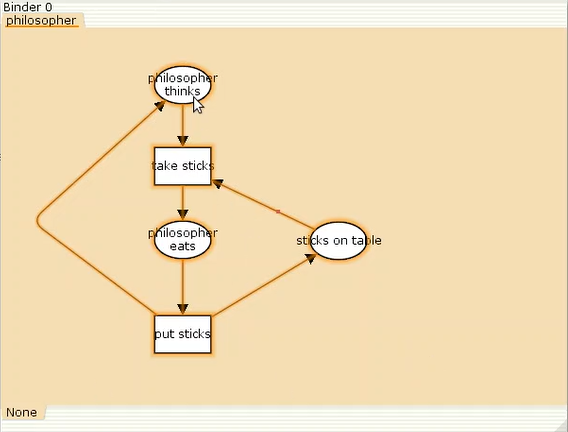
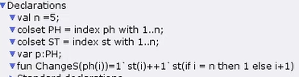
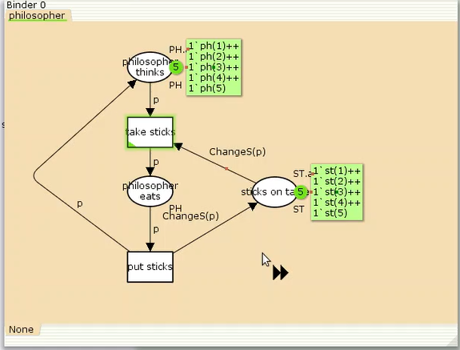
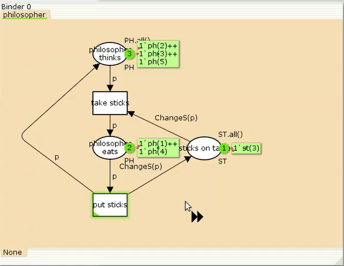
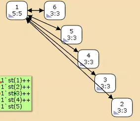

---
## Front matter
lang: ru-RU
title: Лабораторная Работа №10
subtitle: Задача об обедающих мудрецах
author:
  - Гэинэ Андрей
institute:
  - Российский университет дружбы народов им. Патриса Лумумбы, Москва, Россия

## i18n babel
babel-lang: russian
babel-otherlangs: english

## Formatting pdf
toc: false
toc-title: Содержание
slide_level: 2
aspectratio: 169
section-titles: true
theme: metropolis
header-includes:
 - \metroset{progressbar=frametitle,sectionpage=progressbar,numbering=fraction}
 - '\makeatletter'
 - '\makeatother'

## Fonts
mainfont: Arial
romanfont: Arial
sansfont: Arial
monofont: Arial
---

## Докладчик

  * Гэинэ Андрей
  * НФИбд-02-22
  * Российский университет дружбы народов
  * [1032219249@pfur.ru]
  
# Выполнение лабораторной работы

## Цель работы

Реализовать модель задачи об обедающих мудрецах в CPN Tools.

## Задание

- Реализовать модель задачи об обедающих мудрецах  в CPN Tools;
- Вычислить пространство состояний, сформировать отчет о нем и построить граф.

## Рисуем граф сети.

{#fig:001 width=70%}

## задаём новые декларации

{#fig:002 width=70%}

## Получаем работающую модель

{#fig:003 width=70%}

## Запуск модели

{#fig:004 width=70%}

## Построим граф пространства состояний

{#fig:005 width=70%}

## Выводы

В процессе выполнения данной лабораторной работы я реализовала модель задачи об обедающих мудрецах в CPN Tools.