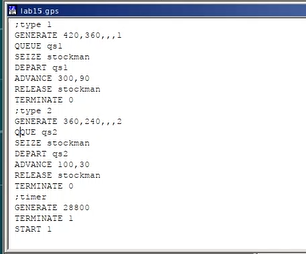
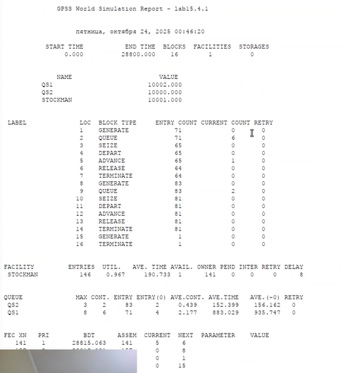
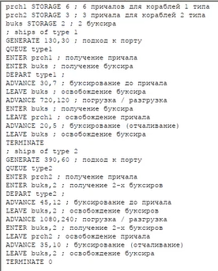

---
## Front matter
lang: ru-RU
title: Лабораторная Работа №15
subtitle: Модели обслуживания с приоритетами
author:
  - Гэинэ Андрей
institute:
  - Российский университет дружбы народов им. Патриса Лумумбы, Москва, Россия

## i18n babel
babel-lang: russian
babel-otherlangs: english

## Formatting pdf
toc: false
toc-title: Содержание
slide_level: 2
aspectratio: 169
section-titles: true
theme: metropolis
header-includes:
 - \metroset{progressbar=frametitle,sectionpage=progressbar,numbering=fraction}
 - '\makeatletter'
 - '\makeatother'

## Fonts
mainfont: Arial
romanfont: Arial
sansfont: Arial
monofont: Arial
---

## Докладчик

  * Гэинэ Андрей
  * НФИбд-02-22
  * Российский университет дружбы народов
  * [1032219249@pfur.ru]
  
# Выполнение лабораторной работы

## Цель работы

Реализовать модели обслуживания с приоритетами и провести анализ результатов.

## Задание

Реализовать с помощью gpss:

- Модель обслуживания механиков на складе
- Модель обслуживания в порту судов двух типов

## Модель обслуживания механиков на складе

На фабрике на складе работает один кладовщик, который выдает запасные части механикам, обслуживающим станки. Время, необходимое для удовлетворения запроса, зависит от типа запасной части.Запросы бывают двух категорий. Для первой
категории интервалы времени прихода механиков $420 \pm 360$ сек., время обслуживания -- $300 \pm 90$ сек. Для второй категории интервалы времени прихода механиков $360 \pm 240$ сек., время обслуживания -- $100 \pm 30$ сек
Порядок обслуживания механиков кладовщиком такой: запросы первой категории обслуживаются только в том случае, когда в очереди нет ни одного запроса второй категории. Внутри одной категории дисциплина обслуживания -- "первым пришел -- первым обслужился". Необходимо создать модель работы кладовой, моделирование выполнять в течение восьмичасового рабочего дня.

## Модель обслуживания механиков с приоритетами

{#fig:001 width=70%}

## Отчет по модели обслуживания механиков с приоритетами

{#fig:002 width=70%}

## Анализ отчета

В рамках имитационного моделирования система была проанализирована на протяжении 28800 моделируемых секунд, начиная с момента времени 0. В процессе моделирования использовалось 16 блоков, один одноканальный ресурс (оформляющий оператор) и не применялось ни одно многоканальное устройство. В модели были задействованы следующие элементы: две очереди для разных типов заявок (QS1 и QS2), а также исполнитель — STOCKMAN.

В течение симуляции было зафиксировано 71 обращение первого типа и 83 — второго. Из них до завершения обработки дошли 64 и 81 соответственно. Всего оператором было принято 146 заявок. Эффективность его загрузки составила 96,7%, а средняя продолжительность работы с заявкой — около 190,73 минут.

## Модель обслуживания в порту судов двух типов

Морские суда двух типов прибывают в порт, где происходит их разгрузка. В порту есть два буксира, обеспечивающих ввод и вывод кораблей из порта. К первому типу судов относятся корабли малого тоннажа, которые требуют использования одного буксира. Корабли второго типа имеют большие размеры, и для их ввода и вывода из порта требуется два буксира. Из-за различия размеров двух типов кораблей необходимы и причалы различного размера. Кроме того, корабли имеют различное время погрузки/разгрузки. 

## Модель обслуживания в порту судов двух типов

{#fig:003 width=70%}

## Отчет по модели обслуживания в порту судов двух типов в gpss

{#fig:004 width=70%}

## Анализ отчета

В процессе симуляции система сформировала 1345 запросов для судов первого типа и 446 для второго. Обработке были подвергнуты практически все из них: 1339 первого типа и 365 второго.

Для судов первого типа в очереди одновременно максимально ожидали до четырёх единиц. К окончанию симуляции эта очередь оказалась полностью свободной. Через неё прошло 1345 обращений, из которых 288 были обслужены сразу, минуя ожидание. Средняя загрузка составляла менее одного судна в любой момент времени (0,750), а средняя длительность пребывания в очереди — около 97,7 минут. Если исключить обращения без ожидания, этот показатель возрастает до 124,35 минут.

## Анализ отчета

Аналогичная структура очереди использовалась и для второго типа судов. Здесь также максимум составлял 4 судна, но к завершению работы в очереди оставались ещё два. Через систему прошло 446 таких запросов, 35 из них были приняты моментально. В среднем в очереди находилось около 0,9 судна, а средняя продолжительность ожидания составила 352,6 минут, увеличиваясь до 382,6 минут при исключении мгновенных обработок.

Все обращения от судов первого типа были направлены на группу из шести причалов. Эти причалы показали высокую эффективность работы — почти 97,7% времени они были заняты, при этом средняя продолжительность обработки одного судна составила 5,86 минут.

## Выводы

В результате выполнения лабораторной работы удалось реализовать модели обслуживания с приоритетами и провести анализ результатов.