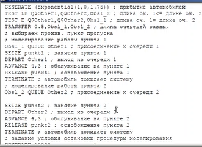
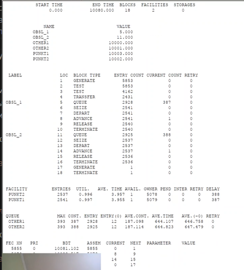
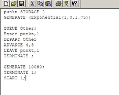
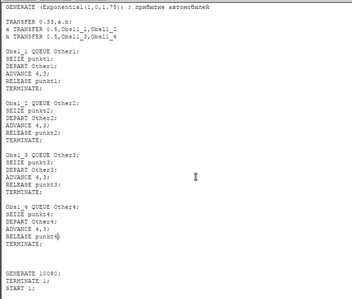
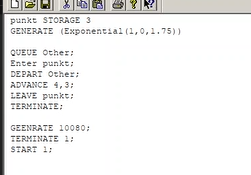
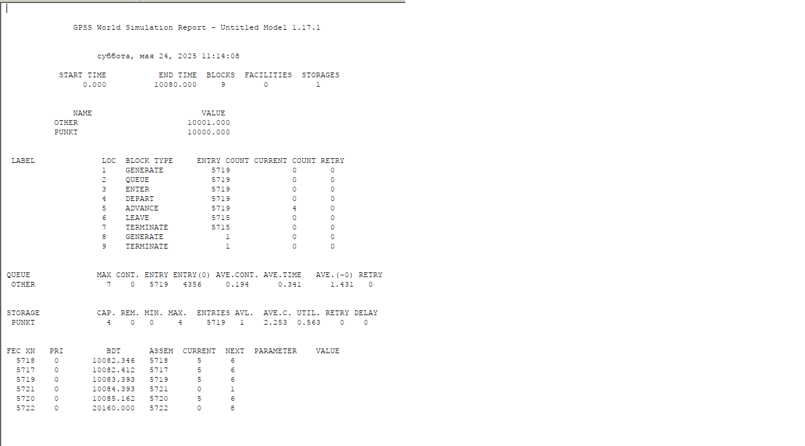

---
## Front matter
lang: ru-RU
title: Лабораторная Работа №16
subtitle:  Задачи оптимизации. Модель двухстратегий обслуживания
author:
  - Гэинэ Андрей
institute:
  - Российский университет дружбы народов им. Патриса Лумумбы, Москва, Россия

## i18n babel
babel-lang: russian
babel-otherlangs: english

## Formatting pdf
toc: false
toc-title: Содержание
slide_level: 2
aspectratio: 169
section-titles: true
theme: metropolis
header-includes:
 - \metroset{progressbar=frametitle,sectionpage=progressbar,numbering=fraction}
 - '\makeatletter'
 - '\makeatother'

## Fonts
mainfont: Arial
romanfont: Arial
sansfont: Arial
monofont: Arial
---

## Докладчик

  * Гэинэ Андрей
  * НФИбд-02-22
  * Российский университет дружбы народов
  * [1032219249@pfur.ru]
  
# Выполнение лабораторной работы

## Цель работы

Реализовать с помощью gpss модель двух стратегий обслуживания и оценить оптимальные параметры.

## Задание

Реализовать с помощью gpss:

- модель с двумя очередями;
- модель с одной очередью;
- изменить модели, чтобы определить оптимальное число пропускных пунктов.

## Постановка задачи

На пограничном контрольно-пропускном пункте транспорта имеются 2 пункта
пропуска. Интервалы времени между поступлением автомобилей имеют экспоненциальное распределение со средним значением $\mu$. Время прохождения автомобилями
пограничного контроля имеет равномерное распределение на интервале $[a, b]$.
Предлагается две стратегии обслуживания прибывающих автомобилей:

1) автомобили образуют две очереди и обслуживаются соответствующими пунктами
пропуска;
2) автомобили образуют одну общую очередь и обслуживаются освободившимся
пунктом пропуска.
Исходные данные: $\mu$ = 1, 75 мин, $a$ = 1 мин, $b$ = 7 мин.

## Построение модели

Целью моделирования является определение:

- характеристик качества обслуживания автомобилей, в частности, средних длин
очередей; среднего времени обслуживания автомобиля; среднего времени пребывания автомобиля на пункте пропуска;
- наилучшей стратегии обслуживания автомобилей на пункте пограничного контроля;
- оптимального количества пропускных пунктов.

## Построение модели

В качестве критериев, используемых для сравнения стратегий обслуживания
автомобилей, выберем:

- коэффициенты загрузки системы;
- максимальные и средние длины очередей;
- средние значения времени ожидания обслуживания.

## Прибывающие автомобили образуют две очереди и обсл. соответств. пропускными пунктами

{#fig:001 width=70%}

## Отчет. Прибывающие автомобили образуют две очереди и обсл. соответств. пропускными пунктами

{#fig:002 width=70%}

## Прибывающие автомобили образуют одну очередь и обсл. освободившимися пропускными пунктами

{#fig:003 width=70%}

## Отчет. Прибывающие автомобили образуют одну очередь и обсл. освободившимися пропускными пунктами

{#fig:004 width=70%}

## Сравнение стратегий

| Показатель                 | стратегия 1 |         |          |  стратегия 2 |
|----------------------------|-------------|---------|----------|--------------|
|                            | пункт 1     | пункт 2 | в целом  |              |
| Поступило автомобилей      | 2928        | 2925    | 5853     | 5719         |
| Обслужено автомобилей      | 2540        | 2536    | 5076     | 5049         |
| Коэффициент загрузки       | 0,997       | 0,996   | 0,9965   | 1            |
| Максимальная длина очереди | 393         | 393     | 786      | 668          |
| Средняя длина очереди      | 187,098     | 187,114 | 374,212  | 344,466      |
| Среднее время ожидания     | 644,107     | 644,823 | 644,465  | 607,138      |

## Сравнение стратегий

Анализ результатов моделирования двух систем показывает, что первая модель способна обработать большее количество автомобилей. Однако стоит отметить, что во второй модели разница между числом поступивших и обслуженных машин меньше, что свидетельствует о более эффективной работе системы. Кроме того, коэффициент загрузки для второй модели достигает 1, что означает полное использование всех пропускных пунктов без простоев. Также показатели, связанные с длиной очередей и временем ожидания, во второй стратегии оказались ниже. Это позволяет считать вторую стратегию более предпочтительной.

## Оптимизация модели двух стратегий обслуживания

Изменим модели под следующие критерии:

- коэффициента загрузки прпускных пунктов принадлежат интервалу [0.5; 0.95];

- среднее число автомобилей, одновременно находящихся на контрольно пропускном пункте, не должно превышать 3;

- среднее время ожидания обслуживания не должно превышать 4 мин.

## Модель с одним пунктам (для обеи стратегий)

{#fig:005 width=70%}

## Отчет. Модель с одним пунктам

{#fig:006 width=70%}

## Анализ

Здесь модель не проходит ни по одному из критериев, тк коэфиициенты загрузки, размер очереди и среднее время ожидания больше.

## Модель для первой стратегии с 3 пропускными пунктами

{#fig:007 width=70%}

## Отчет. Модель для первой стратегии с 3 пропускными пунктами

{#fig:008 width=70%}

## Анализ

Здесь сред кол-во автомобилей в очереди меньше 3 и коэффициента загрузки в нужном диапазоне. Однако сред время ожидания больше 4.

## Модель для первой стратегии с 4 пропускными пунктами

{#fig:009 width=70%}

## Отчет. Модель для первой стратегии с 4 пропускными пунктами

{#fig:010 width=70%}

## Анализ

В этом случае все критерии выполнены, поэтому 4 пункта являются оптимальным количеством для первой стратегии.

## Модель для второй стратегии с 3 пропускными пунктами

{#fig:011 width=70%}

## Отчет. Модель для второй стратегии с 3 пропускными пунктами

{#fig:012 width=70%}

## Анализ

Все критерии выполняются => модель оптимальна.

## Модель для второй стратегии с 4 пропускными пунктами

{#fig:013 width=70%}

## Отчет. Модель для второй стратегии с 4 пропускными пунктами

{#fig:014 width=70%}

## Анализ

В данной ситуации все критерии соблюдены, при этом время ожидания и среднее количество автомобилей оказываются ниже, чем во втором варианте стратегии с тремя пунктами. Однако уровень загрузки также снижается, что говорит о возможной избыточности четвёртого пункта пропуска.

## Анализ

Таким образом, на основе проведённого анализа можно заключить, что оптимальное количество пропускных пунктов составляет три при втором типе обслуживания и четыре при первом.

## Выводы

Реализовал с помощью gpss модель двух стратегий обслуживания и оценить оптимальные параметры.