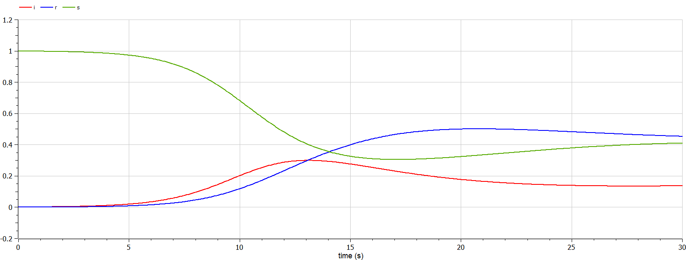
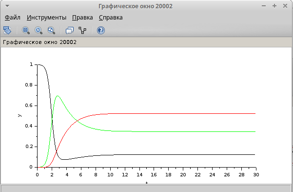

---
## Front matter
lang: ru-RU
title: Лабораторная Работа №5
subtitle: Модель эпидемии (SIR)
author:
  - Гэинэ Андрей
institute:
  - Российский университет дружбы народов им. Патриса Лумумбы, Москва, Россия

## i18n babel
babel-lang: russian
babel-otherlangs: english

## Formatting pdf
toc: false
toc-title: Содержание
slide_level: 2
aspectratio: 169
section-titles: true
theme: metropolis
header-includes:
 - \metroset{progressbar=frametitle,sectionpage=progressbar,numbering=fraction}
 - '\makeatletter'
 - '\makeatother'

## Fonts
mainfont: Arial
romanfont: Arial
sansfont: Arial
monofont: Arial
---

## Докладчик

  * Гэинэ Андрей
  * НФИбд-02-22
  * Российский университет дружбы народов
  * [1032219249@pfur.ru]
  
# Выполнение лабораторной работы

## Цель работы

Построить модель SIR в *xcos* и OpenModelica.

## Задание

1. Реализовать модель SIR в в *xcos*;
2. Реализовать модель SIR с помощью блока Modelica в в *xcos*;
3. Реализовать модель SIR в OpenModelica;
4. Реализовать модель SIR с учётом процесса рождения / гибели особей в xcos (в том числе и с использованием блока Modelica), а также в OpenModelica;
5. Построить графики эпидемического порога при различных значениях параметров модели (в частности изменяя параметр $\mu$);
6. Сделать анализ полученных графиков в зависимости от выбранных значений параметров модели.

## Реализация модели в xcos

{#fig:002 width=70%}

## Реализация модели в xcos

{#fig:006 width=70%}

## Реализация модели с помощью блока Modelica в xcos

{#fig:007 width=70%}

## Реализация модели с помощью блока Modelica в xcos

{#fig:010 width=70%}

## Упражнение

{#fig:012 width=70%}

## Задание для самостоятельного выполнения

{#fig:013 width=70%}

## Задание для самостоятельного выполнения

{#fig:014 width=70%}

## Задание для самостоятельного выполнения

{#fig:015 width=70%}

## Задание для самостоятельного выполнения

{#fig:018 width=70%}

## Задание для самостоятельного выполнения

{#fig:019 width=70%}

## Задание для самостоятельного выполнения($\mu = 0.3$)

{#fig:021 width=70%}

## Задание для самостоятельного выполнения($\mu = 0.9$)

{#fig:022 width=70%}

## Задание для самостоятельного выполнения($\beta = 1$, $\nu = 0.1$, $\mu = 0.1$)

{#fig:023 width=70%}

## Задание для самостоятельного выполнения($\mu = 0.9$)

{#fig:024 width=70%}

## Задание для самостоятельного выполнения($\beta = 4$, $\nu = 0.3, \mu = 0.2$)

{#fig:025 width=70%}

## Выводы

В процессе выполнения данной лабораторной работы была построена модель SIR в *xcos* и OpenModelica.